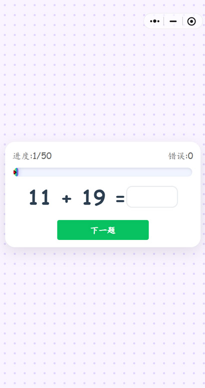
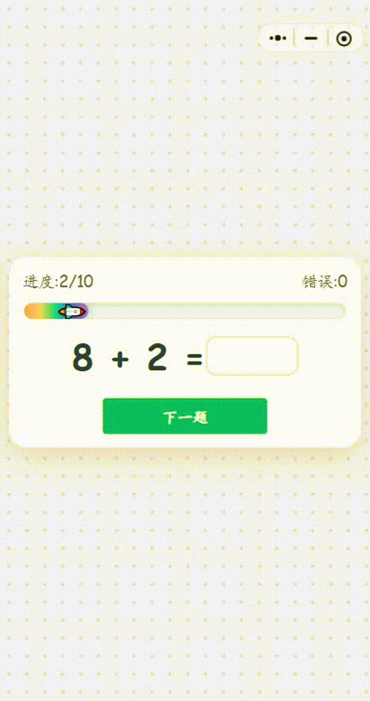
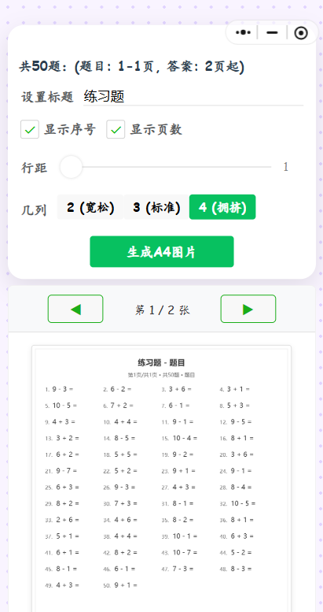
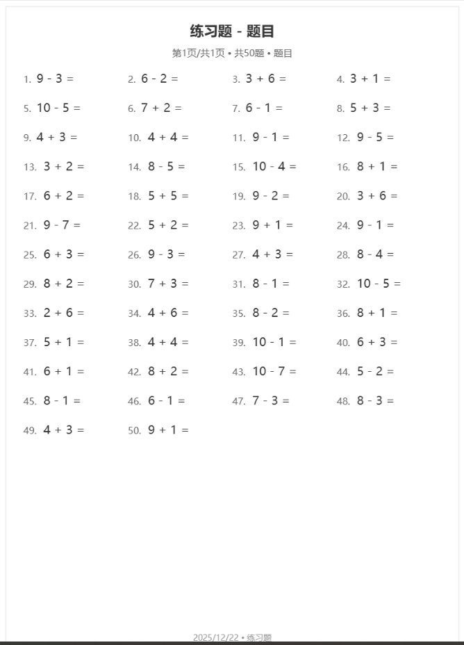

# 数学学习工具

#### 介绍
#### 软件架构
说明
微信小程序--ts+scss
主要用于女儿的日常学习训练 ，自动生成口算题，乘法，除法题，本小程序不存储用户任何信息，每次浏览都需要重新设置生成题的规则，不保存进度，不保存错题，请放心使用

线上体验版本：

### 部分功能截图：
#### 首页

#### 题目选择

#### 在线做题页面

#### 在线做题演示

#### 打印页面

#### 打印效果

